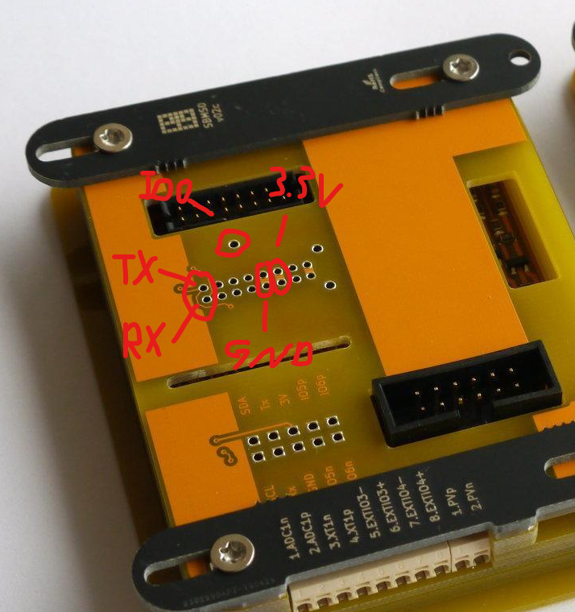

# electrodacus-esp32
[](https://travis-ci.com/armageddon421/electrodacus-esp32)

Firmware for the esp32 on the WiFi-addon of the [electrodacus BMS](http://www.electrodacus.com/).

## Current features

* Handle wifi connection to access point, fallback to provide own WiFi network in case no connection could be made.
* Simple Webinterface for WiFi configuration
* Hosts unaltered electrodacus HTML file (apart from data URL)
* Provides raw data as read by HTML file (you can still use any local HTML file, just change the data URL to `http://[the IP of the device]/rawData`)
* Receiving and caching data from SBMS with unaltered firmware. (ignores AT commands)
* Parsing data from SBMS, usable by Consumers like the MQTT client. (currently only live data)
* MQTT client: publish live data in JSON format whenever it is received from the SBMS main board


## Planned features

Not necessarily in that order.

* OTA updates (configurable, password protected)
* More configuration options (especially for MQTT and data rates)
* More beautiful webpages
* InfluxDB client: create InfluxDB Line-format and send to configurable Server
* NTP Timesync: add reliable timestamps to the data (in case of permanent internet connection)
* TLS encryption: add certificate based authentication and encryption for MQTT and possibly Influxdb endpoints

Please feel free to create issues for any suggestions. I've also added my plans there.

## Requirements

You need a USB to Serial/UART converter with an interface level of 3.3V. **5V will destroy your ESP32.** And any "PC" with any OS supported by plattformIO with installed python (2.7 should do). Make sure pip works.

## Procedure



The basic procedure is as follows:
1. Disconnect the WiFi shield with the ESP32 module from your SBMS. To be safe, unplug the SBMS completely before doing that.
2. Connect the pins RX,TX,GND and 3.3V as shown in the illustration. Your USB to Serial converter will probably already provide 3.3V and enough power, so you can use that. The RX of your converter must be connected to the pin labeled TX and vice versa. It is probably easiest to solder temporary wires to the board.
3. Make a temporary connection from the pin labelled IO0 to GND. This will bring the ESP32 into bootloader mode so you can flash the new firmware.
4. Only now plug in your USB to Serial converter to your USB port (or power up your dedicated 3.3V source).
5. Flash the firmware (see next section)
6. Verify you can reach the device via WiFi. It should create an Access Point with a name starting with SBMS, followed by 12 characters representing a MAC-Address.
7. Disconnect everything you just connected before plugging the WiFi module back onto your SBMS.

As soon as OTA is in place, consecutive updates will be far less painful.

## Installation / Flashing

Open a terminal or cmd window.

1. Clone the repository by either downloading the zip file manually or running:
```
git clone https://github.com/armageddon421/electrodacus-esp32.git
```
And enter the directory
```
cd electrodacus-esp32
```
2. Install PlatformIO
```
pip install -U platformio
platformio update
```
3. Compile the code. Platformio will automatically install any missing dependancies. Check for any errors.
```
platformio run
```
If all goes well, you should see memory usage bars like these and a line below that reading [SUCCESS] in the middle.
```
RAM:   [=         ]  13.5% (used 44224 bytes from 327680 bytes)
Flash: [=======   ]  74.3% (used 973461 bytes from 1310720 bytes)
```
4. Flash! Platformio will usually find the right serial port to use automatically.
```
platformio run --target upload --target uploadfs
```
5. After the process is finished, replug your USB (or power supply) to reboot the ESP32. That should be it.
